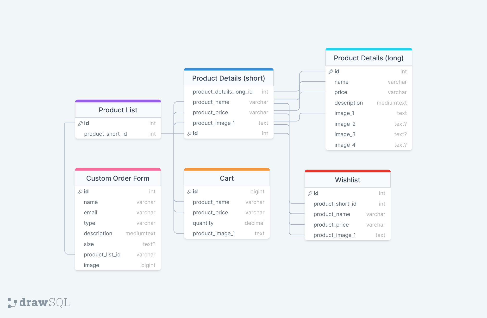

# KP Kustoms

## Overview
<!-- What is your app? Brief description in a couple of sentences. -->
KP Kustoms is the one stop shop for purchasing handmade one of a kind crochet pieces. 

### Problem
<!-- Why is your app needed? Background information around any pain points or other reasons. -->
KP Kustoms is designed t o fill the gap between professionalism and expensive fees in hosting a website for a small business. Etsy is the leading platform for small business but charges high fees that cut into already small profit margins. Selling on social media is free, however it lacks the professionalism and reliablity of a true website. KP Kustoms will allow for my small business to thrive in a professional setting without costing me monthly fees. 

### User Profile
<!-- Who will use your app? How will they use it? Any special considerations that your app must take into account. -->
- Fashion lovers
    - Looking for unqiue pieces to elevate their closet
    - Want handmade crochet items

- Gift shoppers
    - Looking to support small businesses
    - Who want to give a one of a kind gift
    - Want handmade items 

### Features
<!-- List the functionality that your app will include. These can be written as user stories or descriptions with related details. Do not describe _how_ these features are implemented, only _what_ needs to be implemented. -->
- As a user, I want to be able to browse all products
- As a user, I want to view a custom order request form
- As a user, I want to send a custom order request form
- As a user, I want to learn more about the artist creating these prodcts
- As a user, I want to add products to my favourite list
- As a user, I want to view my cart
- As a user, I want to view the checkout process


## Implementation

### Tech Stack
<!-- List technologies that will be used in your app, including any libraries to save time or provide more functionality. Be sure to research any potential limitations. -->
- React
- MySQL
- Express
- Client libraries: 
    - react
    - react-router
    - axios
    - react-popup
    - react-animate-on-scroll
- Server libraries:
    - knex
    - express

    Square checkout. Checkout react plugin.

### APIs
<!-- List any external sources of data that will be used in your app. -->
- No external APIs will be used, I will be creating my own server

### Sitemap
<!-- List the pages of your app with brief descriptions. You can show this visually, or write it out. -->
- Homepage
- Shop products page
- Individual product pages
- Custom order form
- About the shop page
- Wishlist page
- FAQ
- Cart
- Contact


### Mockups
<!-- Provide visuals of your app's screens. You can use tools like Figma or pictures of hand-drawn sketches. -->
#### Homepage


#### Shop products page


#### Individual product pages


#### Custom order form


#### About the shop page


#### Wishlist page


#### FAQ


#### Cart


#### Contact


### Data
<!-- Describe your data and the relationships between them. You can show this visually using diagrams, or write it out.  -->


### Endpoints
<!-- List endpoints that your server will implement, including HTTP methods, parameters, and example responses. -->

**GET /products**

- Returns an array of product objects
- Returns limited information, enough to display in shop all page

Parameters:
- id: product id as number

Response:
```
[
    {
        "id": 1,
        "name": "Mushroom bag charms",
        "price": "$8.99",
        "image_1": "http:/localhost:8080/images/mushroom_1.jpg"
    },
...
]

```

**GET /products/:id**

- Returns a detailed object of a signle product
- id must be swapped out with the id of a product as found in the list of products

Parameters:
- id: product_id as number

Response:
```
    {
        "id": 1,
        "name": "Mushroom bag charms",
        "price": "$8.99",
        "description": "Adorable bag charms. Perfect for carrying your chapstick or lighter, our bag charms are fashionable and functional",
        "image_1": "http:/localhost:8080/images/mushroom_1.jpg",
        "image_2": "http:/localhost:8080/images/mushroom_2.jpg",
        "image_3": "http:/localhost:8080/images/mushroom_3.jpg",
        "image_4": "http:/localhost:8080/images/mushroom_4.jpg"
    }

```

**POST /custom_order_form**

- Creates an upload of a new custom order form

Parameters:
- id: product id as number to reference current product offerings to serve as a reference

Response:
```
    {
        "id": 1,
        "name": "Jan Doe",
        "email": "janedoe@gmail.com",
        "type": "sweater",
        "description": "Hello! I am looking to have a custom sweater made in the flower power style.",
        "size": "medium",
        "product_list_id": 7,
        "image": "colour_palette_ref.png"
    }

```

**PUT /cart/:product_id**

- Adds new items to cart

Parameters:
- id: product id as number
- product_name as name
- product_price as price
- product_image_1 as product image

Response:
```
    {
        "id": 1,
        "product_name": "Mushroom bag charms",
        "product_price": "$8.99",
        "quantity": 1,
        "product_image_1": "http:/localhost:8080/images/mushroom_1.jpg"
    }

```

**DELETE /cart/:product_id**

- Removes an item from cart

Parameters:
- id: product id as number

Response:
```
    {
        "id": 1,
        "product_name": "Mushroom bag charms",
        "product_price": "$8.99",
        "quantity": 1,
        "product_image_1": "http:/localhost:8080/images/mushroom_1.jpg"
    }

```

**PUT /wishlist/:product_id**

- Adds a new item to wishlist

Parameters:
- id: product id as number
- product_name as name
- product_price as price
- product_image_1 as product image

Response:
```
    {
        "id": 1,
        "product_short_id": 1,
        "product_name": "Mushroom bag charms",
        "product_price": "$8.99",
        "product_image_1": "http:/localhost:8080/images/mushroom_1.jpg"
    }

```

**DELETE /wishlist/:product_id**

- Removes an item from wishlist

Parameters:
- id: product id as number

Response:
```
    {
        "id": 1,
        "product_short_id": 1,
        "product_name": "Mushroom bag charms",
        "product_price": "$8.99",
        "product_image_1": "http:/localhost:8080/images/mushroom_1.jpg"
    }

```

### Auth
<!-- Does your project include any login or user profile functionality? If so, describe how authentication/authorization will be implemented. -->
N/A

## Roadmap
<!-- Scope your project as a sprint. Break down the tasks that will need to be completed and map out timeframes for implementation. Think about what you can reasonably complete before the due date. The more detail you provide, the easier it will be to build. -->

- Create client
    - react project with routes and boilerplate pages

- Create Server
    - express project with routing, with placeholder 200 responses

- Create migrations

- Gather 28 products 
    - 4 images
    - names
    - prices
    - descriptions

- Create seeds with product data

- Deploy client and server projects so all commits will be reflected in production

- Create main components
    - Create header component
    - Create footer component
    - Create custom order banner
    - Implement components on main app

- Feature: Home page
    - Create CTA
    - Create GET /products/:id

- Feature: Shop Products
    - Create GET /products
    - Create shop products banners
    - Implement custom order banner

- Feature: Individual Product Page
    - Implement GET /products/:id
    - Implement PUT /cart/:product_id
    - Implement shop related products banners
    - Implement custom order banner

- Feature: Custom Order Form
    - Implement custom order banner
    - Create order form
    - Create POST /custom_form_order

- Feature: About page
    - Create header component
    - Create image component
    - Create quote component

- Feature: Wishlist page
    - Implement GET /product/:id
    - Implement PUT /cart/:product_id
    - Implement DELETE /wishlist/:product_id
    - Implement custom order banner
    - Implement shop suggested products banners

- Feature: FAQ page
    - Create image component
    - Create dropdown FAQ section

- Feature: Cart
    - Implement GET /product/:product_id
    - Implement DELETE /cart/:product_id

- Feature: Contact page
    - Create image component
    - Create contact info component

- Bug fixes

- DEMO DAY

- Publish Site Live

## Nice-to-haves
<!-- Your project will be marked based on what you committed to in the above document. Under nice-to-haves, you can list any additional features you may complete if you have extra time, or after finishing. -->
- Checkout process
- Shipping calculation
- Log in process